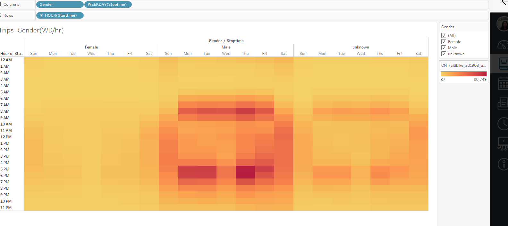

# bikesharing
# Overview
The purpose of the project is  to convince  investors that a bike-sharing program in Des Moines is a solid business proposal.To solidify the proposal, one of the key stakeholders would like to see a bike trip analysis.
 
# Results
 ### Cleaning the data
 
 Using Jupyter Notebook changed the trip duration data to a datetime field with correct time format.
 
 
 
   
  
  ### Created Visualizations for Trip Analysis
    Using Tableau,visualization of data was created
    
   #### Created the Checkout Times for Users Viz
   The bike usage reaches a top 146k minutes per user
   
   
   
    
    
   
  ### Created checkout times by Gender
   
 The checkout times by Gender graph shows Males are significantly higher users than others

   
 
  ###  Created the Trips by Weekday for Each Hour Viz
 Trips by Weekday for Each Hour Viz graph shows ,peak riding on weekdays is from 6am-9am and 4pm-9pm and on weekends 7am-9pm
 
  
  
  ### Created the trips by Gender (wd/hr)
  Trips by Gender graph shows Males are high users during peak hours.
  
  
  
  ### Created the User Trips by Gender by Weekday
  
  Male Dubscribers are high followed by Female subscribers
  
   
   
   
   August is the  month having peak riding hours
   
   
  
   
   
   
   ### Created a story in Tableau
   
   
   
   ### Summary
   
   In NYC August month has high peak riding hours that is from from 5pm to 7pm.Based on this bar chart maintainance can be performed from 2am to 5am.
   From graph analysis shows Males subscribers are the highest users and follow high use time.
   
   
    
   
   
   
     
   
  
    
  
  
 
 
 
   
  
